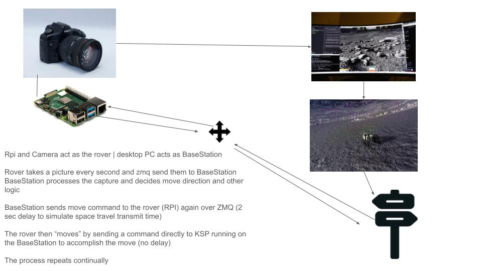

# LunarPi
LunarPi: A Dual-Phase Lunar Rover Simulator

This is a lunar rover simulator, by using a raspberrypi 2 model B with a connected EOS-6D camera as the rover and my desktop pc as a basestation
I intend to manuever the rover (a moon rover in Kerbal Space Program) autonomosly by detecting features and navigating the lunar surface.
This process I will display capturing initial images, splitting them into small cells to train my AI model after I catagorize them by hand and duplicate them using minor techniques to increase the training data size.
Here is the process overview:
 

 
I have already proven that this technique will work with my initial training data, and plan on refining that data for further improvements before I create the navigation piece and attempt to run the full test. 
 

 
Now I have made some refinements to the detection process and processed over 2-million variations of image snippets below is the result of that refinement.
 

 
The above image is ideal conditions but those are what I hope to find to properly test this rather than being in a rocky area from the start. I will proceed using this model to develop the manuver logic to controll the rover while avoiding rocks, I have to put some brain power in how to keep up with the images and navigation as processing each image may exceed the desired 4 second round trip time, though decision making should be fairly quick in comparison.

